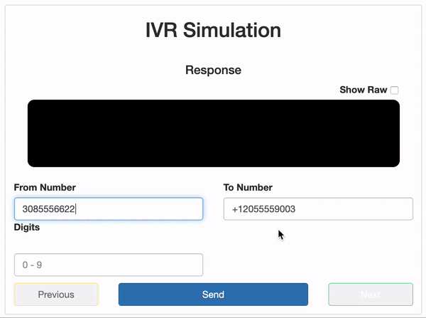

# twilio-ivr-test-suite

## Index ##

* [About](#about)
* [Setup](#setup)
* [Issues](#issues)
* [Contributing](#contributing)

## About ## 

This is a light-weight testing suite for Twilio IVR which utilizes jQuery and Bootstrap. Simply add the URL to the URL returning TwiML to start!

* Visit [my website](https://jrquick.com) for other cool projects!

## Setup

### Installation

* Clone: `git clone git@github.com:jrquick17/twilio-ivr-test-suite.git`
* Change URL: ``
* Open in browser

## Issues ##

If you find any issues feel free to open a request in [the Issues tab](https://github.com/jrquick17/twilio-ivr-test-suite/issues). If I have the time I will try to solve any issues but cannot make any guarantees. Feel free to contribute yourself.

## Contributing

A special thanks to all of our contributors! To contribute yourself just submit a [pull request](https://github.com/jrquick17/twilio-ivr-test-suite/pulls)!

* [jrquick17](https://github.com/jrquick17)
